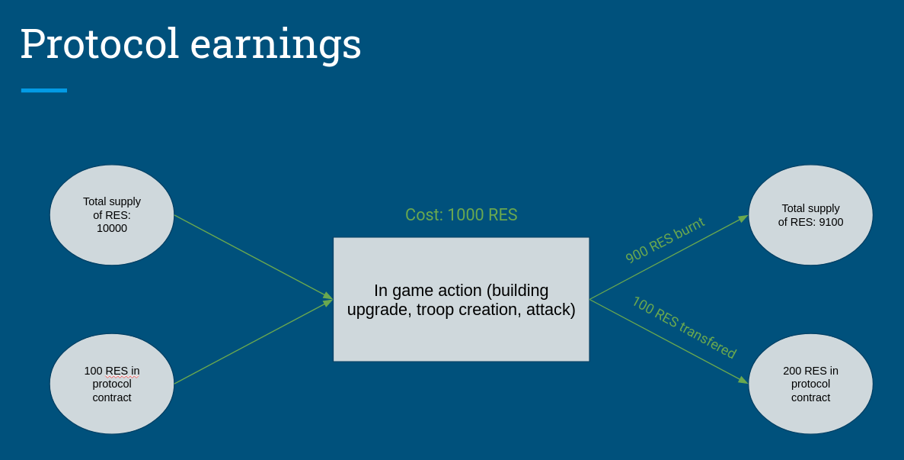

## Inspiration
Liquidity on DEXes is a crucial factor which is responsible for costs of swap (slippages) and liquidity providing efficiency (pernament loss). Dexes usually compete for liquidity providers by offering high APRs often with highly inflationary tokens what obscures real APY. Our protocol offers different approach to attract liquidity - entertainment. What if I tell you, you can benefit from current LP farms and additionally have a fun ? Don't you be interested use our protocol instead of others ? We have taken an ide from **pool together** extended it and transmitted to the fantasy world where you can fight with other players for LP rewards without exposing yourself to risk of loosing LP tokens (LP tokens will always come back to you).

## What it does
Liquidity wars is no lose game when players deploy its liquidity to play in the game. At the end of the game each player can redeem the same amount of liquidity tokens (LP). The main rules in the game is to get as many resources (RES) as it is possible. The RES will be the base for rewards distributions which will be derived from LP tokens rewards. In order to get RES players can attack and rob each other, develop infrastruture to get more resources, increase defence or places to hide RES from the aggressor. The purpose of the project is to not be another play to earn game but to be play **and** earn game which will atract potential investors to provide and lock their liquidity. The targets of the projects are not only players but DEXes which will want to increase liquidity by our game. That is why another goal of the game is to have configurable game where each DEX can configure its game and some game parameters (game duration, additional rewards, allowed LP tokens).

## How we built it
Tech-stack:
- hardhat - smart contracts
- next.js - front-end
- quicknode - it is important to have quick rpc node provider especially during tests

Blockchain:
- Polygon - it allows to perform fast transactions that are crucial for our game because users will be interacting with the game a lot

We used a lot of chainlink utils to make the game:
-  self-managable - keepers which automatically starts, ends game (in certain conditions) and distribute resources basinc on farm level
-  randomized - VRF has been used to get some randomized factors that have some influence durring battle
-  price feeds - allowed to calculate proper LP tokens required to deposit

## Challenges we ran into
1. Set up multiple keepers and using checkData and performData to steer the logic dependent on conditions.
2. Get number of required LP tokens to start the game basing on calibrated required USD amount and price feeds.
3. Design smart contracts structure so that they will not exceed maximum smart contract size for deployment.
4. Simulate dummy rewards for the LP pool due to lack rewards of mumbai network.
5. Emit event in such a way that will be able to filtered.

## Accomplishments that we're proud of
1. Battle system which using VRF randomized number and some constant factors to calculate outcomes.
2. Working keepers which assure that game autmatically changes states and distributes rewards when game is running.
3. Fully responsive frontend.
4. Logging attacks/defences for each players

## What we learned
1. How to emit and filter events in the front-end.
2. How to design reasonably sized smart contracts without stack too deep erors.
3. 

## What's next for Liquidity Wars
- Allow to accept more LP tokens and assign each token to the nation. Each nation will have some special bonuses to troops and buildings. Example: dwarfs will be better in defense and orcs will be better in ofense
- Provide fully configurable game and strategies - that allows dexes to configure the game as they wish (game duration, additional rewards, allowed LP tokens). It will be achieved by usage of low-level solidity encoded calldata. 

- Introduce special building the root which will provide some bonuses basing on the LP price to corresponding nation
- 
